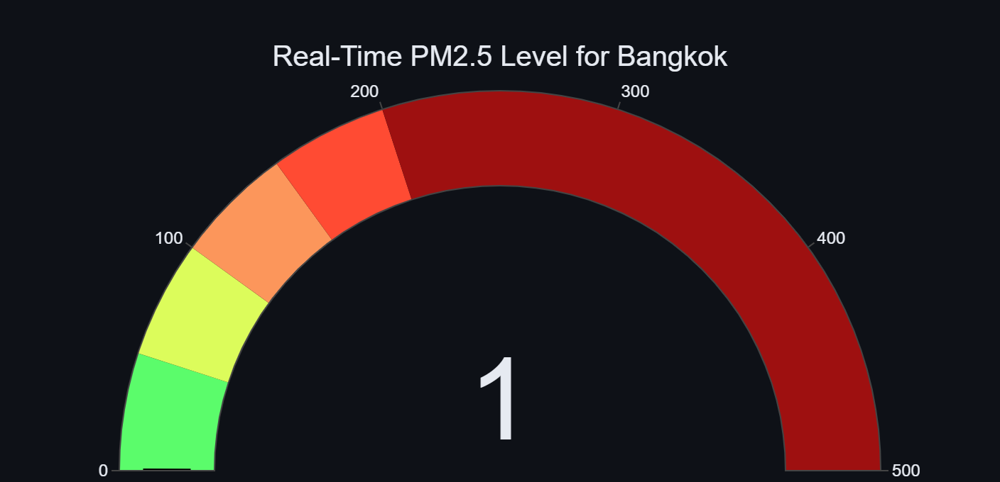
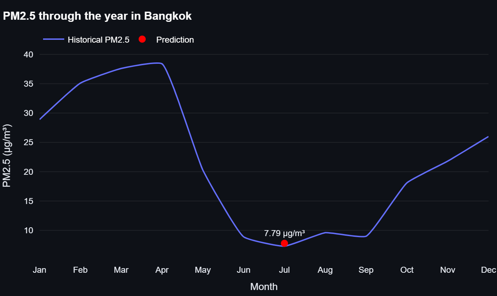
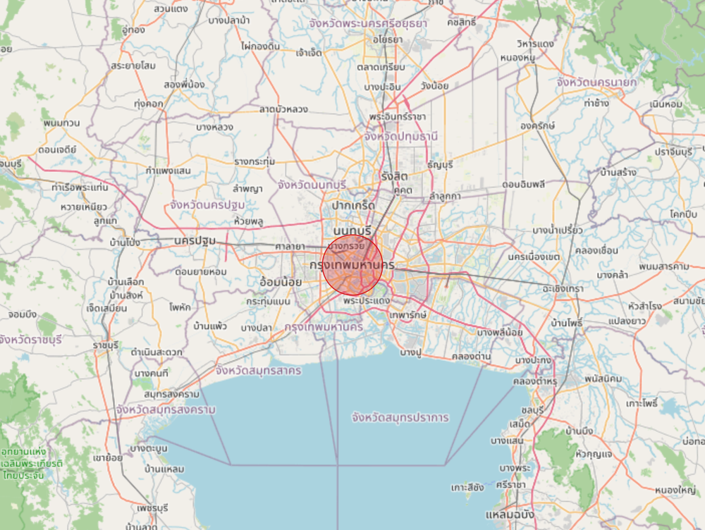

# everyAir
###### everyAir makes your every day air!
EveryAir” on Smart Air-Quality Prediction System: Forecasting Pollution Level. In this Python based assignment libraries like panda, matplotlib, seaborn, statsmodels, numpy, folium are used to analyse provided data in Asia_Dataset.csv, as well as forecasting future PM2.5 Air Pollution data to help with air pollution prediction in numbers of Asian countries(2000+ in dataset).

Data Preprocessing: Load data, handle missing values and insert current date. Extract viable data from the data.
Import Coordinates: Insert LATs and LONs of the specified cities, and predict the PM2.5 air pollution level accordingly.
Numerical Analysis: Month mapping, converting month strings into numerical values. Analyze PM2.5 trends and build an air pollution prediction model using Random Forest Regressor on Historical data and Real-time data.
Data Visualisation: Plotting air pollution trends and display real-time gauge meter for PM2.5 data for the relevant cities. Geospatial mapping visualisation for predicted and real-time PM2.5 level in the city.

## Screenshots

Shots of the thing actually running, because a folder of `.py` files proves nothing.

### Real-time gauge

Current reading off OpenWeather, dropped on a 0 to 500 scale. The colour bands
are the usual AQI breakpoints, so you can read it without reading the number.
Bangkok on a good afternoon sits near the floor, which is less exciting than it
sounds.

### Forecast against history

Blue line is the twelve month PM2.5 history straight out of `Asia_Dataset.csv`.
Red dot is what the Random Forest thinks a given month looks like. The dry
season spike from February to April and the monsoon dip around June fall out of
the data on their own, which is a good sign the model is not just drawing a
flat line through the mean.

Months read as names rather than 1 to 12, the legend sits along the top so the
plot keeps the full width, and the only labelled point is the prediction. A
number on every point is noise.

### Weather and urban features

Eight tiles, each with an icon, a label, the number, and what the number is in.
Population density, street density, NDVI greenness and distance to the nearest
industrial site, then temperature, wind, humidity and rainfall. Those are what
the model eats, not decoration.

`50+ km` on the industry tile is a real answer rather than a failure. Overpass
gets asked for industrial landuse inside a 50 km box and sometimes there is
genuinely nothing in it, so the tile says so instead of the page falling over.

These are hand rolled rather than `st.metric`. Streamlit's own metric truncates
long labels, and its third argument is a delta, so passing `"people/km2"` there
puts a green up arrow beside the number as though population density had just
improved.

### The map

One marker on the city, sized and coloured by the predicted value, because that
is all the model can honestly support.

It started as a solid square. The grid was feeding (lat, lon) pairs into a
model trained on [month, yearly average], so the values coming back were not
predictions of anything, and since latitude and longitude barely move across a
0.2 degree box they were all near identical.

The proper fix was to feed the model something that genuinely varies per point.
Distance to the nearest industrial site does, so the map now builds a real
grid, computes that distance for every cell, and asks the model. Then it checks
whether the answers actually differ. They do not: training is one row per month
for a single city, which leaves distance constant across all twelve rows, so
the model never learns anything from it and returns the same number everywhere.

So the app draws the marker and says why, rather than shading a flat field that
implies detail it does not have. If the surface ever does vary, the heat layer
appears on its own.