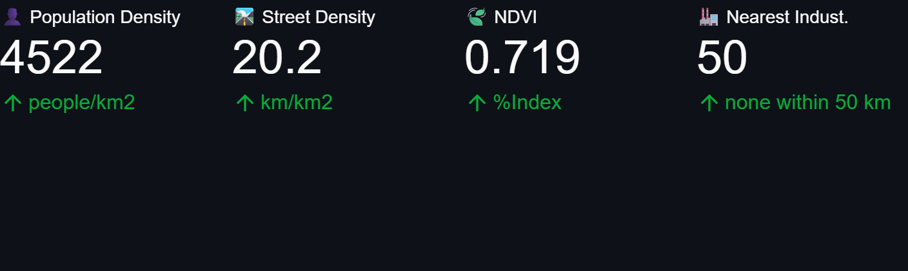
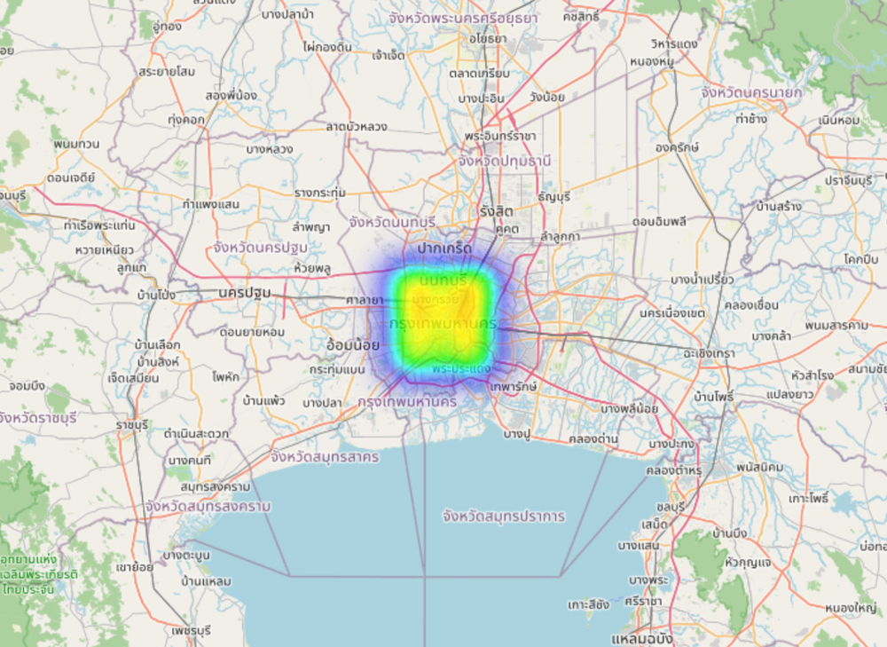

# everyAir
###### everyAir makes your every day air!
EveryAir” on Smart Air-Quality Prediction System: Forecasting Pollution Level. In this Python based assignment libraries like panda, matplotlib, seaborn, statsmodels, numpy, folium are used to analyse provided data in Asia_Dataset.csv, as well as forecasting future PM2.5 Air Pollution data to help with air pollution prediction in numbers of Asian countries(2000+ in dataset).

Data Preprocessing: Load data, handle missing values and insert current date. Extract viable data from the data.
Import Coordinates: Insert LATs and LONs of the specified cities, and predict the PM2.5 air pollution level accordingly.
Numerical Analysis: Month mapping, converting month strings into numerical values. Analyze PM2.5 trends and build an air pollution prediction model using Random Forest Regressor on Historical data and Real-time data.
Data Visualisation: Plotting air pollution trends and display real-time gauge meter for PM2.5 data for the relevant cities. Geospatial mapping visualisation for predicted and real-time PM2.5 level in the city.

## Screenshots

Shots of the thing actually running, because a folder of `.py` files proves nothing.

### Real-time gauge

Current reading off OpenWeather, dropped on a 0 to 500 scale. The colour bands
are the usual AQI breakpoints, so you can read it without reading the number.
Bangkok on a good afternoon sits near the floor, which is less exciting than it
sounds.

### Forecast against history

Blue line is the twelve month PM2.5 history straight out of `Asia_Dataset.csv`.
Red dot is what the Random Forest thinks a given month looks like. The dry
season spike from February to April and the monsoon dip around June fall out of
the data on their own, which is a good sign the model is not just drawing a
flat line through the mean.

### Weather and urban features

The numbers the model actually eats. Population density, street density, NDVI
greenness, and how far the nearest industrial site is. "None within 50 km" is a
real answer rather than a failure: Overpass gets asked for industrial landuse
inside a 50 km box, and sometimes there is genuinely nothing in it.

### Geospatial heatmap

Folium with a heat layer over the predicted grid. Hot core, cooler edges, and
it lands on where the city actually is instead of the middle of the bounding
box, which is the bug you get when the lat and lon go in the wrong order.
